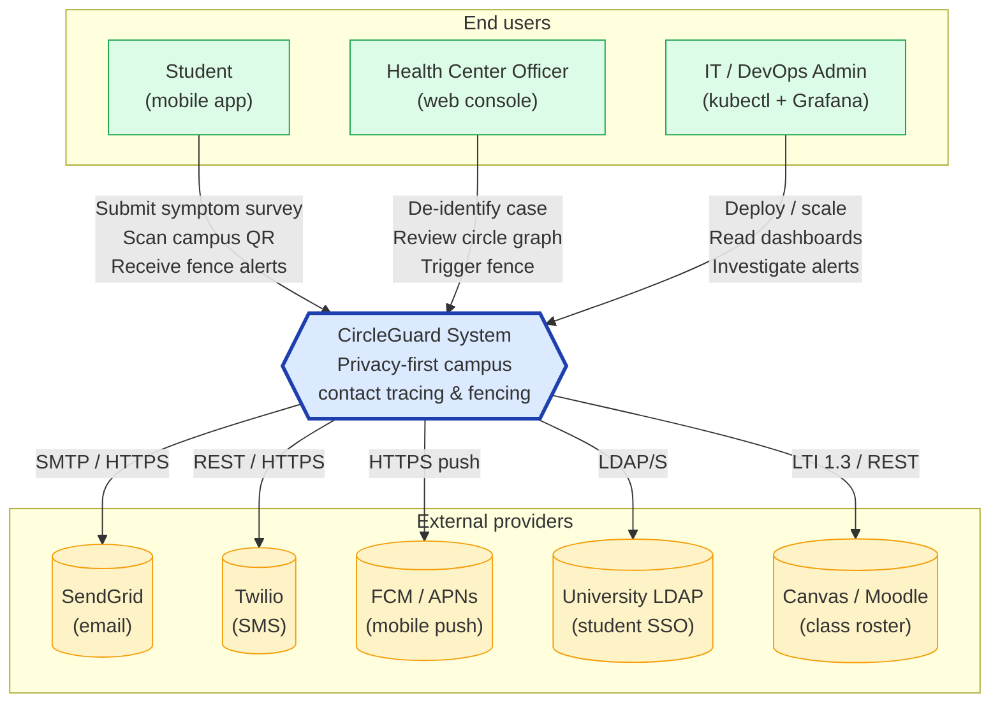
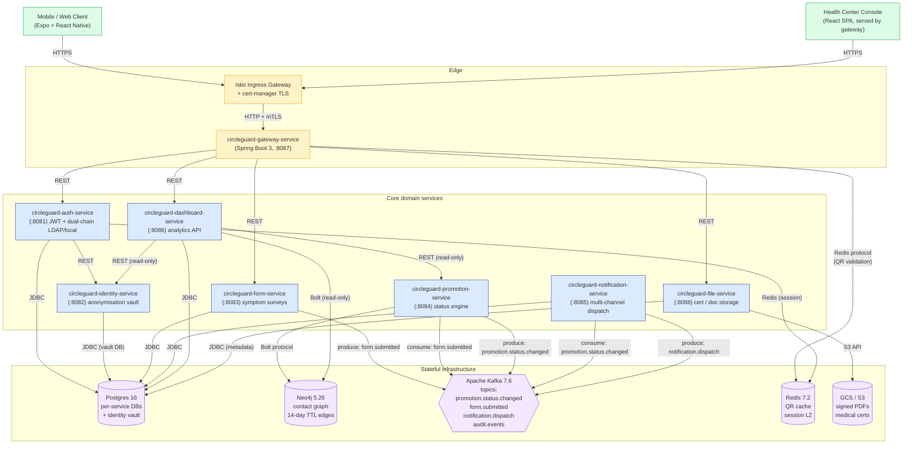
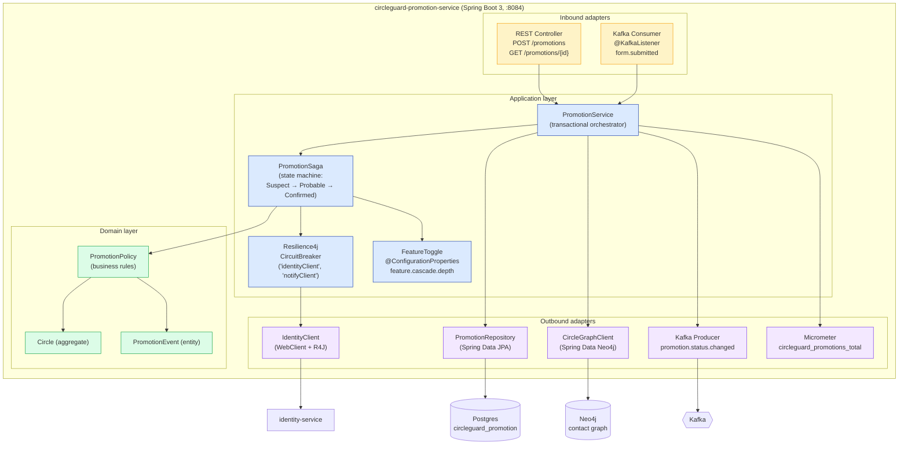
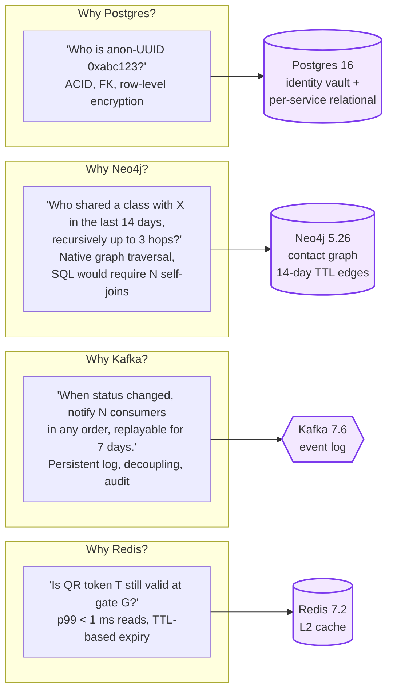
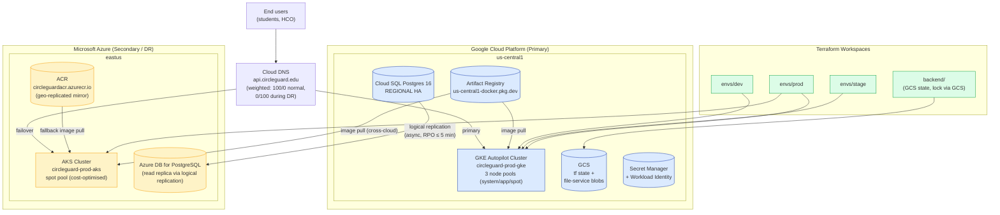
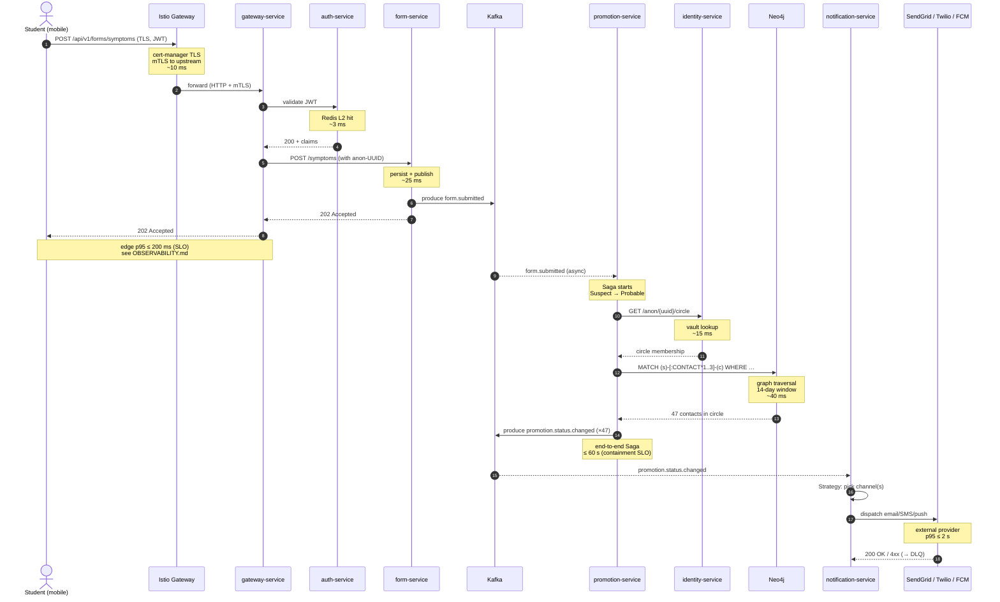
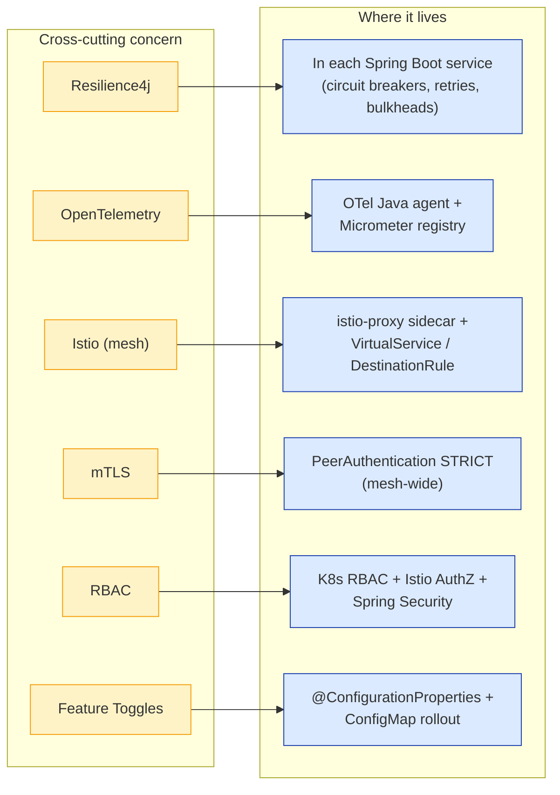

# CircleGuard — System Architecture

This document is the **single source of truth** for the CircleGuard system
architecture. It uses the [C4 model](https://c4model.com/) to present the
system at three levels of zoom (Context → Container → Component), then
zooms further into data, deployment, and cross-cutting concerns.

> Companion documents:
> - [`OPERATIONS.md`](OPERATIONS.md) — how to run this in prod.
> - [`SECURITY.md`](SECURITY.md) — controls referenced from §7 here.
> - [`OBSERVABILITY.md`](OBSERVABILITY.md) — metrics/logs/traces stack.
> - [`PATTERNS.md`](PATTERNS.md) — design patterns referenced from §3.
> - [`CHAOS_EXPERIMENTS.md`](CHAOS_EXPERIMENTS.md) — fault-injection plans.
> - [`COSTS.md`](COSTS.md) — cost / capacity model behind §5.

---

## 1. C4 Level 1 — System Context

CircleGuard sits between three end-user populations and a small set of
external messaging providers. The system has **one logical address**
(`api.circleguard.<campus>.edu`) regardless of which microservice
ultimately handles a request.

**Key invariants from this view:**

- Students never talk to internal services directly — every request enters
  through the **Gateway** (containerised as `circleguard-gateway-service`).
- The system never *originates* an SMS / Email / Push — it only *requests*
  delivery via a vetted external provider, so message-platform compliance
  (CAN-SPAM, TCPA) lives outside our trust boundary.
- LDAP and LMS are **read-only** integrations; CircleGuard is never a
  write source for the campus's identity systems.

---

## 2. C4 Level 2 — Container

Eight Spring Boot services, three stateful data stores, one cache, one
message bus, and one ingress.

### 2.1 Service responsibilities (one-liner each)

| Service                    | Port | Owns                                                                                              |
|----------------------------|-----:|---------------------------------------------------------------------------------------------------|
| `gateway-service`          | 8087 | Public ingress, QR validation against Redis, request fan-out.                                     |
| `auth-service`             | 8081 | JWT issuance, dual-chain LDAP/local authentication, RBAC claim assembly.                          |
| `identity-service`         | 8082 | Salted-hash anonymisation vault, "right-to-be-forgotten" purges, real-name ↔ anon UUID mapping.   |
| `form-service`             | 8083 | Dynamic symptom-survey rendering, submission persistence, Kafka publish.                          |
| `promotion-service`        | 8084 | Status engine (`Suspect → Probable → Confirmed`), recursive Neo4j traversal, Saga orchestration.  |
| `notification-service`     | 8085 | Strategy-pattern multi-channel dispatcher (Email, SMS, Push, LMS), DLQ + retries.                 |
| `dashboard-service`        | 8086 | Aggregated read-only analytics for Health Center console (hotspots, circle counts).               |
| `file-service`             | 8088 | Signed-URL upload/download of medical certificates to S3-compatible storage.                      |

### 2.2 Kafka topic catalogue

| Topic                        | Producer                | Consumer(s)                              | Schema                          |
|------------------------------|-------------------------|------------------------------------------|----------------------------------|
| `form.submitted`             | `form-service`          | `promotion-service`                      | `SymptomSurveyEvent` (Avro)      |
| `promotion.status.changed`   | `promotion-service`     | `notification-service`, `dashboard-service` | `StatusPromotionEvent` (Avro)  |
| `notification.dispatch`      | `notification-service`  | (DLQ retry consumer in same service)     | `DispatchAttemptEvent` (JSON)    |
| `audit.events`               | *all services*          | log-shipper to Loki + GCS                | `AuditEvent` (JSON)              |
| `identity.purge.requested`   | `auth-service`          | `identity-service`                       | `PurgeRequestEvent` (Avro)       |

---

## 3. C4 Level 3 — Component (`promotion-service` deep dive)

`promotion-service` is the heart of CircleGuard. We zoom in on it because
(a) it owns the most business logic, (b) it touches every data store, and
(c) it implements the Saga pattern that the rest of the system rides on
(see [`PATTERNS.md`](PATTERNS.md) §2.4).

The layering follows hexagonal architecture: **adapters depend on the
application; the application depends on the domain; the domain depends on
nothing**. Tests assert this with ArchUnit at build time.

---

## 4. Data architecture (hybrid, four stores)

Different questions deserve different data engines. We chose four:

| Store    | Why this and not Postgres alone?                                                                          | Containment strategy                                                |
|----------|-----------------------------------------------------------------------------------------------------------|---------------------------------------------------------------------|
| Postgres | ACID, row-level encryption, mature backup/PITR. Identity vault must be auditable.                         | Per-service database; vault DB has its own schema and credentials.  |
| Neo4j    | A 3-hop contact query is a single `MATCH` in Cypher vs a 3-table self-join in SQL — orders of magnitude faster at scale. | Edges TTL'd at 14 days; only anon UUIDs stored, never real names.   |
| Kafka    | Decouples publishers from N consumers, persistent audit log, replayable for forensics.                    | Topic retention = 7 days; sensitive payloads carry only anon UUIDs. |
| Redis    | Sub-ms QR validation at campus gates; rate-limiting; session L2.                                          | TTLs aggressive (≤ 15 min); no PII written, only opaque tokens.     |

**Critical privacy invariant:** Neo4j, Kafka, and Redis **never** see a
real name or government-ID number. The mapping `real-id → anon-UUID`
exists in exactly one row of one Postgres table guarded by
`identity-service`. This single chokepoint is what makes FERPA compliance
practical — see [`SECURITY.md`](SECURITY.md) §7.

---

## 5. Deployment topology (multi-cloud)

Production runs on **GKE in `us-central1`** as primary, with **AKS in
`eastus`** as warm-standby for the multi-cloud bonus. State storage and
container images live in GCP; AKS pulls the same images cross-cloud.

**Multi-cloud DR strategy** (referenced from [`OPERATIONS.md`](OPERATIONS.md) §6):

| Concern            | Primary (GCP)                                | Secondary (Azure)                              | RPO       | RTO        |
|--------------------|----------------------------------------------|------------------------------------------------|-----------|------------|
| Compute            | GKE Autopilot, 3 zones in us-central1        | AKS spot pool, eastus                          | n/a       | < 15 min   |
| Relational DB      | Cloud SQL REGIONAL HA + 7-day PITR           | Azure PG read-replica (logical replication)    | ≤ 5 min   | < 30 min   |
| Object storage     | GCS multi-region                             | (none — file-service is bridged via GCS API)   | 0         | n/a        |
| Container images   | Artifact Registry                            | ACR mirrored via `acr import` on every release | 0         | n/a        |
| Secrets            | GCP Secret Manager                           | Azure Key Vault (manual seed at DR drill)      | n/a       | < 60 min   |
| DNS                | Cloud DNS weighted records                   | Promoted to 100 % via runbook                  | n/a       | < 5 min    |

**Cost rationale** for the asymmetry (no AKS HA Postgres, no AKS hot
standby) lives in [`COSTS.md`](COSTS.md) §1 and §5 — keeping AKS to a
warm spot pool keeps the DR option open at ~10 % of the cost of a true
active/active multi-cloud setup.

---

## 6. End-to-end request flow

The reference flow: **a student submits a symptom survey, and a fence
cascades to everyone in their circle**. Timings are p95 budgets from
[`OBSERVABILITY.md`](OBSERVABILITY.md) §3.

**Budget summary:** the synchronous edge (steps 1–7) must complete in
≤ 200 ms p95; the async cascade (steps 8–18) must complete in ≤ 60 s p99
per the headline *Containment Speed* metric in `README.md`. Both SLOs are
wired to alerts in [`OBSERVABILITY.md`](OBSERVABILITY.md) §3.

---

## 7. Cross-cutting concerns

Where each platform-level concern is implemented in the diagrams above:

| Concern              | Implementation                                                                                                              | Doc reference                                                              |
|----------------------|-----------------------------------------------------------------------------------------------------------------------------|----------------------------------------------------------------------------|
| **Resilience4j**     | Circuit breaker + retry + bulkhead beans configured in each service's `application.yaml`; metrics emitted to Prometheus.    | [`PATTERNS.md`](PATTERNS.md) §2.1                                          |
| **OpenTelemetry**    | Java agent attached at JVM start (`-javaagent:opentelemetry-javaagent.jar`); OTLP push to Jaeger; trace IDs in MDC for log correlation. | [`OBSERVABILITY.md`](OBSERVABILITY.md) §1                       |
| **Istio**            | Sidecar per pod; `VirtualService` for canary routing and retries; `DestinationRule` for connection-pool circuit-breaking.    | `infra/k8s/istio/`                                                          |
| **mTLS**             | `PeerAuthentication` set to `STRICT` mesh-wide; cert-manager issues public cert to the Istio ingress only.                  | `infra/k8s/istio/peer-authentication-strict.yaml`, [`SECURITY.md`](SECURITY.md) §4 |
| **RBAC**             | Three layers: K8s RBAC (cluster ops), Istio `AuthorizationPolicy` (service-to-service), Spring Security (end-user roles).   | [`SECURITY.md`](SECURITY.md) §3                                            |
| **Feature Toggles**  | `@ConfigurationProperties("feature")` + K8s ConfigMap; rollout policy described in change-management doc.                   | [`PATTERNS.md`](PATTERNS.md) §2.2, [`CHANGE_MANAGEMENT.md`](CHANGE_MANAGEMENT.md) |
| **Chaos engineering**| Chaos Mesh installed in `chaos-mesh` namespace; experiments target `circleguard-dev` only.                                   | [`CHAOS_EXPERIMENTS.md`](CHAOS_EXPERIMENTS.md)                              |
| **FinOps**           | Spot pools dev/stage, scale-to-zero CronJobs, billing export to BigQuery.                                                    | [`COSTS.md`](COSTS.md)                                                      |

---

## 8. Architecture Decision Records (rolled up)

The decisions baked into the diagrams above, with the rejected
alternatives:

| Decision                                    | Chose             | Rejected                  | Why                                                                       |
|---------------------------------------------|-------------------|---------------------------|---------------------------------------------------------------------------|
| Primary cloud                               | GCP               | AWS / Azure-only          | Free GKE control plane on dev; team familiarity; cheapest egress for us.  |
| Secondary cloud (DR + bonus)                | Azure             | Self-managed colo / multi-region GCP | Real multi-cloud demonstrates vendor-independence; AKS spot is cheap.   |
| Primary graph store                         | Neo4j             | Postgres + recursive CTEs | 3-hop traversal performance gap is orders of magnitude.                   |
| Event bus                                   | Apache Kafka      | RabbitMQ / Pub/Sub        | Persistent log + replay required for audit / forensics.                   |
| Cache                                       | Redis             | Memcached / in-JVM Caffeine| Need cross-pod TTL semantics for QR tokens.                              |
| Log store                                   | Grafana Loki      | ELK stack                 | Single binary, label-indexed, cheaper object storage. See [`OBSERVABILITY.md`](OBSERVABILITY.md) §6. |
| Tracing                                     | Jaeger (OTLP)     | Zipkin / Tempo            | Native OTLP + UI maturity.                                                |
| Service mesh                                | Istio             | Linkerd / Consul          | Richest AuthZ policy model; required for the mesh bonus.                  |
| IaC                                         | Terraform         | Pulumi / Crossplane       | Most widely understood + the rubric explicitly calls for it.              |
| CI/CD                                       | GitLab CI         | Jenkins (legacy) / GitHub Actions | Native MR + environments + protected variables.                  |

---

## 9. What this architecture deliberately is *not*

- **Not serverless.** The latency floor for cold starts (>1 s) would
  blow the QR-validation SLO. We accept the cost of always-on pods.
- **Not active/active multi-cloud.** Async replication is RPO ≤ 5 min;
  we explicitly trade RPO for cost and operational simplicity.
- **Not a single monolith with one DB.** Database-per-service is a
  precondition for the privacy story — `identity-service`'s vault
  cannot be browsable by any other deployment.
- **Not "Kubernetes-native at the app layer".** Services know nothing
  about Kubernetes (no `KubernetesClient` calls); they consume config
  via Spring's standard mechanisms and could in principle run on plain
  VMs. This keeps local dev possible (`docker-compose.dev.yml`).
