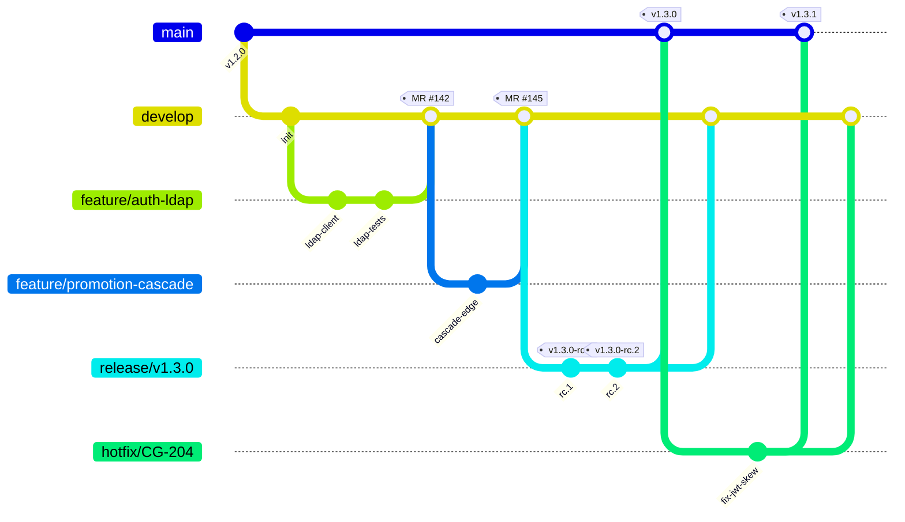

# CircleGuard — Branching Strategy

This document specifies the **GitFlow** branching model used by the CircleGuard
monorepo. It is the contract between the CI/CD pipelines, the change-management
process, and any contributor opening a merge request.

> Companion documents:
> - [`AGILE_METHODOLOGY.md`](AGILE_METHODOLOGY.md) — how sprints feed branches.
> - [`CHANGE_MANAGEMENT.md`](CHANGE_MANAGEMENT.md) — how branches become releases.
> - [`SPRINTS.md`](SPRINTS.md) — sprint backlog with the issues feeding branches.

---

## 1. Branch Catalog

| Branch                         | Purpose                                                      | Lifetime         | Protected | Deploys to |
|--------------------------------|--------------------------------------------------------------|------------------|-----------|------------|
| `main`                         | Production-ready source of truth. Every commit is taggable.  | Permanent        | Yes       | `circleguard-master` (prod) |
| `develop`                      | Integration branch — accumulates finished features.          | Permanent        | Yes       | `circleguard-dev` (dev) |
| `feature/<scope>-<short-desc>` | One vertical slice of one user story (or sub-task).          | Hours to days    | No        | Ephemeral preview (optional) |
| `release/v<x.y.z>`             | Stabilization branch for a candidate release.                | 1–5 days         | Yes       | `circleguard-stage` (stage) |
| `hotfix/<ticket>-<desc>`       | Emergency fix branched directly from `main`.                 | Hours            | No        | `circleguard-stage` → `circleguard-master` |
| `chore/<short-desc>`           | Pure maintenance (deps, formatting, CI tweaks). No new code paths. | Hours        | No        | Dev only |

### Naming Rules

- `<scope>` is one of the service slugs (`auth`, `identity`, `form`, `promotion`,
  `notification`, `gateway`, `dashboard`, `file`) or `infra`, `ci`, `mobile`, `docs`.
- `<short-desc>` is `kebab-case`, ≤ 40 chars, no story IDs in the slug.
- The story ID (`CG-014`, etc.) goes in the **commit body** and the **MR title**,
  not the branch name — branches are throwaway, IDs travel through commits.

Examples:

```
feature/promotion-graph-traversal
feature/infra-terraform-eks-module
release/v1.3.0
hotfix/CG-204-jwt-clock-skew
chore/ci-gitlab-runner-image
```

---

## 2. Flow Diagram



Read it left-to-right:

1. Work always **starts from `develop`** as a `feature/*` branch.
2. Features merge back into `develop` via Merge Request — never pushed directly.
3. When `develop` is feature-complete for a sprint, a `release/v<x.y.z>` branch
   is cut. Only **bug fixes** are accepted onto it (no new features).
4. The release branch is merged into **both** `main` (tagged `vX.Y.Z`) and
   back into `develop` to capture stabilization fixes.
5. Production incidents create `hotfix/*` from `main`, merge into `main` with a
   patch tag, and are immediately back-merged into `develop`.

---

## 3. Merge Request Rules

All branches except `main` and `develop` MUST be integrated via a GitLab Merge
Request that satisfies **every** rule below before the merge button is enabled.

| Rule                                          | Enforced by                | Applies to              |
|-----------------------------------------------|----------------------------|-------------------------|
| At least **1 reviewer approval** (2 for `release/*` and `hotfix/*`) | GitLab branch protection rules | All MRs |
| CI pipeline status **passed** (`build`, `unit`, `integration`, `lint`, `security-scan`) | GitLab `Merge When Pipeline Succeeds` | All MRs |
| **No direct push** to `main`, `develop`, `release/*`             | GitLab push rules | These branches |
| MR title prefixed with **Conventional Commit** type (e.g. `feat(promotion): …`) | Commit-lint job in `.gitlab-ci.yml` | All MRs |
| Linked **GitLab issue** (`Closes #CG-014`) | MR template checklist | Feature/bug MRs |
| Updated docs and tests | Reviewer checklist (`docs/`, `tests/`) | All MRs |
| Squash-merge enabled on `feature/*`, merge-commit on `release/*` and `hotfix/*` | GitLab project setting | Per branch type |

`main` and `develop` are protected as follows:

- `Allowed to push`: **No one** (force-push disabled, including maintainers).
- `Allowed to merge`: **Maintainers** only, via MR.
- `Code owners approval`: required for changes under `services/*/src/main/` and `k8s/`.

---

## 4. Commit Message Convention (Conventional Commits)

Commits MUST follow the [Conventional Commits 1.0](https://www.conventionalcommits.org/)
spec. This is non-negotiable because `semantic-release` parses the log to:

- Decide the next SemVer bump (`fix:` → patch, `feat:` → minor, `BREAKING CHANGE:` → major).
- Generate the `CHANGELOG.md` and Release Notes (see `CHANGE_MANAGEMENT.md`).

### Allowed types

| Type        | When to use                                | SemVer impact |
|-------------|--------------------------------------------|---------------|
| `feat`      | New user-facing capability                 | minor         |
| `fix`       | Bug fix                                    | patch         |
| `perf`      | Performance improvement                    | patch         |
| `refactor`  | Internal restructure, no behavior change   | none          |
| `docs`      | Documentation only                         | none          |
| `test`      | Add or improve tests                       | none          |
| `build`     | Build system / Gradle / Docker changes     | none          |
| `ci`        | CI configuration changes                   | none          |
| `chore`     | Housekeeping (deps, lint config)           | none          |
| `revert`    | Revert a previous commit                   | depends       |

### Format

```
<type>(<scope>): <short summary, imperative, ≤ 72 chars>

<body — wrap at 80 cols, explain WHY not WHAT>

Refs: CG-014
Closes: CG-019
BREAKING CHANGE: <description, if applicable>
```

### Examples

```
feat(promotion): cascade Suspect → Probable in <60s

Adds recursive Cypher traversal on contact edges within the 14-day
temporal window. Replaces the previous polling job.

Refs: CG-007
```

```
fix(gateway): reject QR tokens with future iat claim

A clock-skew of >5s on the device side was producing spurious
PERMIT decisions because `iat > now` was not validated.

Closes: CG-204
```

---

## 5. Tagging Strategy (SemVer)

All production releases are tagged on `main` using **annotated, signed** tags:

```
vMAJOR.MINOR.PATCH                # production tag, e.g. v1.3.0
vMAJOR.MINOR.PATCH-rc.N           # release-candidate tag on release/* branches
vMAJOR.MINOR.PATCH-hotfix.N       # rarely used; hotfixes normally bump PATCH
```

- **MAJOR** — Breaking API or schema change (REST contract removal, DB drop column).
- **MINOR** — Backward-compatible feature.
- **PATCH** — Backward-compatible fix or perf improvement.

The tag is created **only** by the master pipeline (`Jenkinsfile.master` /
`.gitlab-ci.yml::tag-release` job). Humans never tag manually on `main`.

Release candidates (`-rc.N`) are pushed by the stage pipeline whenever a
commit lands on a `release/*` branch.

---

## 6. Hotfix Workflow — Worked Example

Scenario: production at `v1.3.0` is rejecting all QR scans because the JWT
clock-skew validator is too strict. Incident `CG-204` is opened.

```bash
# 1. Branch from main (NOT develop) — main reflects what is in prod
git checkout main && git pull
git checkout -b hotfix/CG-204-jwt-clock-skew

# 2. Fix + test
$EDITOR services/circleguard-gateway-service/src/main/java/.../JwtValidator.java
./gradlew :services:circleguard-gateway-service:test

# 3. Conventional Commit
git commit -m "fix(gateway): allow 5s clock-skew on QR JWT iat

Closes: CG-204"

# 4. Push and open an MR targeting main (NOT develop)
git push -u origin hotfix/CG-204-jwt-clock-skew
glab mr create --target-branch main --title "fix(gateway): allow 5s clock-skew on QR JWT iat"

# 5. After MR is merged into main, the master pipeline:
#    - runs the full test suite
#    - bumps to v1.3.1 via semantic-release
#    - deploys to circleguard-master
#    - generates RELEASE_NOTES_v1.3.1.md
#    - opens an auto-MR to back-merge main → develop
```

The hotfix MUST also be back-merged into `develop` (the auto-MR above) so that
the fix is not lost in the next minor release.

---

## 7. Branch → Environment → Cluster Mapping

| Branch        | Trigger          | Cluster Namespace        | URL pattern                              | Owner            |
|---------------|------------------|--------------------------|------------------------------------------|------------------|
| `feature/*`   | MR pipeline       | (none — unit/integration only) | n/a                                    | Author           |
| `develop`     | Push / merge      | `circleguard-dev`        | `*.dev.circleguard.internal`             | Dev team         |
| `release/*`   | Push to branch    | `circleguard-stage`      | `*.stage.circleguard.internal`           | QA + Release Mgr |
| `main`        | Tag `v*`          | `circleguard-master`     | `*.circleguard.app`                      | Release Mgr + Ops|
| `hotfix/*`    | MR pipeline       | `circleguard-stage` first, then `circleguard-master` after manual approval | same as above | Incident Cmdr |

This mapping is the same one enforced by `Jenkinsfile.dev`, `Jenkinsfile.stage`,
`Jenkinsfile.master` today, and will be enforced by `.gitlab-ci.yml` once the
GitLab migration (story **CG-002**) lands.

---

## 8. References

- [Vincent Driessen, "A successful Git branching model" (2010)](https://nvie.com/posts/a-successful-git-branching-model/) — original GitFlow.
- [Conventional Commits 1.0](https://www.conventionalcommits.org/en/v1.0.0/)
- [Semantic Versioning 2.0](https://semver.org/)
- [GitLab — Protected branches](https://docs.gitlab.com/ee/user/project/protected_branches.html)
- Internal: `RELEASE_NOTES_v1.0.1778728283.md` — sample release notes produced by
  the master pipeline.
