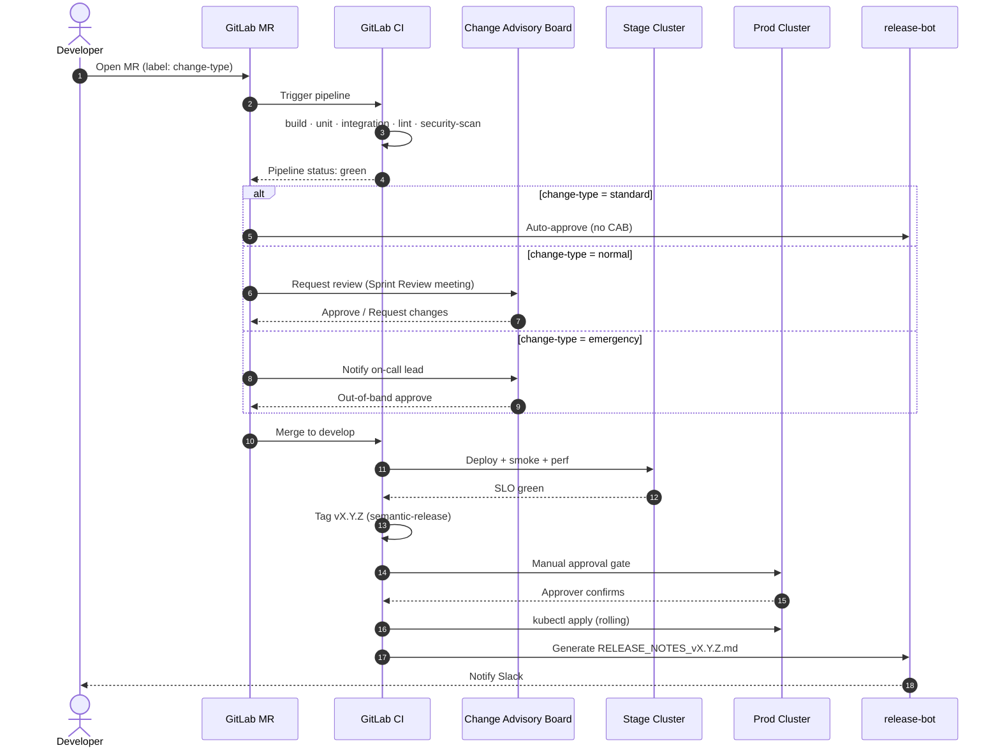

# CircleGuard — Change Management

This document formalizes how changes flow from a developer's laptop to
production. It is ITIL-aligned without being ITIL-pedantic: the goal is *fast
and safe*, in that order.

> Related: [`BRANCHING.md`](BRANCHING.md), [`AGILE_METHODOLOGY.md`](AGILE_METHODOLOGY.md),
> [`SPRINTS.md`](SPRINTS.md).

---

## 1. Change Types

| Type        | Examples                                                       | Approval                          | Lead time | Window                    |
|-------------|----------------------------------------------------------------|-----------------------------------|-----------|---------------------------|
| **Standard**| Minor dep bump (no API change), doc tweak, dashboard JSON edit | Pre-approved (any maintainer)     | minutes   | Any time                  |
| **Normal**  | Feature, schema migration, new endpoint, infra resize          | CAB review at Sprint Review       | 1–2 weeks | Within sprint cadence     |
| **Emergency**| Hotfix for prod incident affecting users                      | Incident commander + on-call lead | < 1 hour  | Any time (outside windows) |

Every MR carries a `change-type:standard | change-type:normal | change-type:emergency`
GitLab label. The `release-bot` reads the label to:

- Decide whether to require CAB sign-off on the MR description.
- Decide whether to skip the manual approval gate in the prod pipeline.
- Tag the resulting release-notes entry accordingly.

---

## 2. Approval Flow



The "manual approval gate" before prod is enforced by the master pipeline
(`Jenkinsfile.master` today, the `deploy:prod` job in `.gitlab-ci.yml` after
`CG-002`). For *emergency* changes, the approver may be the on-call engineer
themselves — but the gate still fires, so we keep a record.

---

## 3. Rollback Plan Template

Every Normal and Emergency change MUST attach a filled-in rollback plan to its
MR description. Standard changes inherit the template below by default.

### 3.1 Kubernetes rollback

```bash
# 0. Identify the bad revision
kubectl -n circleguard-master rollout history deployment/<service>

# 1. Roll back to the previous revision (canonical path)
kubectl -n circleguard-master rollout undo deployment/<service>

# 1b. (alternative) Pin to a specific revision
kubectl -n circleguard-master rollout undo deployment/<service> --to-revision=<N>

# 2. Watch the rollback complete
kubectl -n circleguard-master rollout status deployment/<service> --timeout=5m

# 3. Confirm via SLO dashboard that error rate returns to baseline within 5 min
```

If the bad change touched multiple services, repeat per service in the
*reverse* order they were deployed (LIFO).

### 3.2 Database rollback (Flyway / Liquibase)

Schema migrations are managed by Flyway. The rollback rules:

- Every forward migration `V<N>__<desc>.sql` MUST be paired with an
  `U<N>__<desc>.sql` undo script (Flyway Teams) **or** a documented compensating
  forward migration `V<N+1>__revert_<desc>.sql`.
- For backward-incompatible changes (column drop, type change), we ship the
  change in **two releases**:
  1. Release *N* — additive only (new column, dual-write, deploy code that
     can read either shape).
  2. Release *N+1* — remove the old shape once telemetry confirms zero
     readers/writers remain.

```bash
# Inspect current state
flyway -url=jdbc:postgresql://... -user=$U -password=$P info

# Undo (Flyway Teams)
flyway undo -target=<previous_version>

# Or apply the compensating migration
flyway migrate
```

If Flyway is on the free edition and `undo` is unavailable, the
compensating-migration approach is mandatory — *do not* edit history.

### 3.3 Cache / CDN invalidation

```bash
# Redis flush of stale gateway-status keys
redis-cli -h <host> --scan --pattern 'gateway:status:*' | xargs -n 50 redis-cli -h <host> del

# CDN cache purge (CloudFront)
aws cloudfront create-invalidation \
  --distribution-id <DIST_ID> \
  --paths '/api/*'
```

Always invalidate caches **after** the deploy/rollback completes, otherwise a
stale entry will repopulate from the still-bad pod.

### 3.4 Communication template

```
[ROLLBACK] CircleGuard vX.Y.Z reverted to vX.Y.Z-1 at HH:MM UTC.
Reason: <one-line summary>
Impact: <users / services / duration>
Mitigation: kubectl rollout undo across <list of services>
Next steps: post-mortem in #incidents within 24h, GitLab issue CG-NNN.
```

This template is posted in `#circleguard-ops` and pinned for 24 hours.

---

## 4. Release Notes Process

Release notes are produced by `scripts/generate-release-notes.sh` (current) and
will be produced by `semantic-release` (after `CG-002`). The pipeline order is:

1. **Automated generation** — On every `main` tag, the pipeline runs
   `semantic-release` (or the script) to:
   - Compute the next SemVer bump from the Conventional Commits since the
     previous tag.
   - Generate `CHANGELOG.md` and `RELEASE_NOTES_vX.Y.Z.md`.
   - Categorize entries into Features / Fixes / Refactors / Tests / Docs /
     Infrastructure.
2. **Manual review window** — The pipeline pauses on the manual approval gate
   (see section 2) so the Release Manager can:
   - Read the auto-generated notes.
   - Adjust wording if needed (commit on `main` before approving).
   - Confirm the CAB sign-off table is filled.
3. **Publication** — After approval, the notes are:
   - Committed to the repo as `RELEASE_NOTES_vX.Y.Z.md`.
   - Posted as a GitLab Release attached to the tag.
   - Linked in Slack `#circleguard-releases`.

A sample of the auto-generated format is committed at the root of the repo, see
[`RELEASE_NOTES_v1.0.1778728283.md`](../RELEASE_NOTES_v1.0.1778728283.md). It
contains:

- Identification header (Version, Date, Commit, Previous Tag, Build, Environment).
- Executive Summary + diff-stat.
- Categorized Changes (by Conventional Commit type).
- Test Summary table.
- Services Deployed table (image:tag).
- Performance row vs. SLO.
- Rollback procedure (concrete `kubectl` commands).
- CAB sign-off table.
- Post-deployment checks checklist.

---

## 5. Tagging Convention

The full tagging convention is in [`BRANCHING.md § 5`](BRANCHING.md#5-tagging-strategy-semver).
In short:

- `vMAJOR.MINOR.PATCH` on `main` — produced by the master pipeline only.
- `vMAJOR.MINOR.PATCH-rc.N` on `release/*` — produced by the stage pipeline.
- Tags are annotated and (ideally) signed; the master pipeline uses a CI-managed
  signing key.

Every release-notes filename matches the tag exactly. There is **one and only
one** release-notes file per tag.

---

## 6. Auditability

For each production change we keep, indefinitely:

- The GitLab MR (description, approvals, CI logs).
- The signed tag on `main`.
- The `RELEASE_NOTES_vX.Y.Z.md` file in the repo.
- The CAB sign-off table inside the release notes.
- The Slack `#circleguard-releases` message (exported monthly).

This satisfies the *Identification, Categorization, Verification, Configuration
record, Back-out plan, Approval record, Validation* dimensions called out in
the Taller 2 report.

---

## 7. References

- [`BRANCHING.md`](BRANCHING.md) — branch types and tagging.
- [`AGILE_METHODOLOGY.md`](AGILE_METHODOLOGY.md) — ceremonies feeding CAB.
- [`SPRINTS.md`](SPRINTS.md) — sprint cadence.
- [Conventional Commits 1.0](https://www.conventionalcommits.org/)
- [Semantic Versioning 2.0](https://semver.org/)
- [Flyway — Undo Migrations](https://documentation.red-gate.com/fd/migrations-184127470.html)
- Sample: [`RELEASE_NOTES_v1.0.1778728283.md`](../RELEASE_NOTES_v1.0.1778728283.md).
