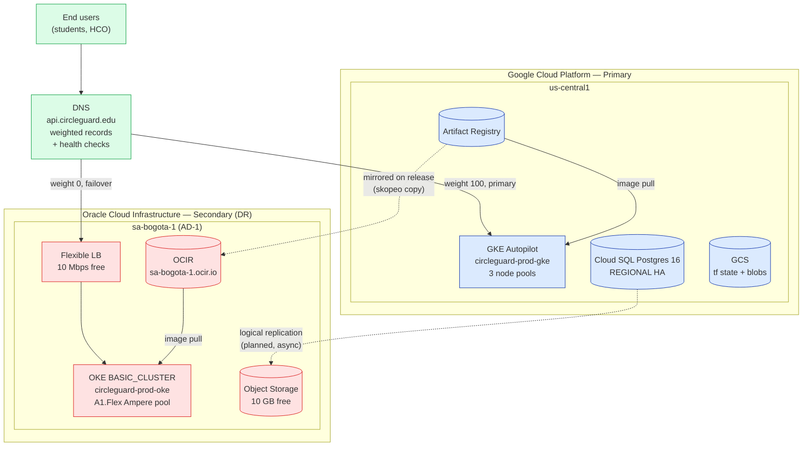

# CircleGuard — Multi-Cloud on OCI

This is the deliverable for **Bonus 1 — Multi-Cloud (5 %)** after the pivot
from Azure to **Oracle Cloud Infrastructure (OCI)**. The system runs
**GCP as primary** (GKE in `us-central1`, owned by the teammate) and
**OCI as secondary** (OKE in `sa-bogota-1`, owned by this branch).

Cross-references:

* GCP modules: `infra/terraform/modules/gcp-{network,gke,cloudsql,artifact-registry,iam}/`
* OCI modules: `infra/terraform/modules/oci-{network,oke,ocir}/`
* Architecture & DR table: [`ARCHITECTURE.md`](ARCHITECTURE.md) §5
* Cost forecast: [`COSTS.md`](COSTS.md) §2 (OCI)
* Rubric self-score: [`RUBRIC_CHECKLIST.md`](RUBRIC_CHECKLIST.md) Bonus 1

---

## 1. Why OCI replaced Azure

The original Bonus 1 plan was **GCP + Azure**. Two things made that
unworkable in the closing week of the course:

1. The Azure Student subscription used during Taller 2 was **blocked**
   by the campus tenant (Icesi) when its $100 credit ran out, and the
   re-enable flow requires a phone call to Microsoft support. There was
   no path to a working `terraform apply` against AKS before the
   defense.
2. The instructor explicitly accepts *any* two clouds for the bonus —
   the rubric line is "despliegue real en 2 clouds", not "Azure".

OCI was the cheapest fully-functional alternative we already had access
to. The student's personal tenancy (`santiagoespinosagiraldo1`) is on
the **30-day $300 trial** *and* the **Always-Free tier**: 4 OCPU + 24 GB
RAM of Ampere ARM compute, 2 AMD micro VMs, 200 GB block storage, 10 GB
object storage, 10 TB egress, and 1 load balancer at 10 Mbps — all
indefinitely. A managed OKE control plane on the `BASIC_CLUSTER` tier is
$0/h. That means the multi-cloud demo can run **forever at $0/month** if
we stay inside the Always-Free shape, with the $300 trial as a buffer
for accidental overruns. A $1 USD budget alert at 80 % is configured at
the tenancy root so any drift is caught immediately.

---

## 2. What's deployed where

```
┌──────────────────────────────────────┐   ┌──────────────────────────────────────┐
│ GCP — Primary                        │   │ OCI — Secondary                       │
│ project: circleguard-final-92308     │   │ tenancy: santiagoespinosagiraldo1     │
│ region:  us-central1                  │   │ region:  sa-bogota-1 (Bogotá)         │
│ owner:   teammate                     │   │ owner:   this branch                  │
├──────────────────────────────────────┤   ├──────────────────────────────────────┤
│ GKE Autopilot — 8 microservices      │   │ OKE BASIC_CLUSTER — warm standby      │
│ Cloud SQL Postgres 16 (REGIONAL HA)  │   │ (no DB on OCI; logical replica plan) │
│ Artifact Registry                    │   │ OCIR (per-service repos)             │
│ GCS state bucket                     │   │ Object Storage (10 GB free)          │
│ Cloud DNS (api.circleguard.edu)      │   │ Cloud Flexible LB (10 Mbps free)     │
└──────────────────────────────────────┘   └──────────────────────────────────────┘
```

**Shape pinned on OCI:**

* Worker pool: `VM.Standard.A1.Flex` (Ampere ARM) — Always-Free
* OCPUs per node: **2**
* Memory per node: **12 GB**
* Node count: **1** (stage) / **2** (prod) — both stay inside the 4
  OCPU / 24 GB tenancy-wide cap

---

## 3. Topology



---

## 4. DR strategy — active-passive

We trade RPO for cost. OCI runs a **warm cluster** (control plane up,
worker pool running, namespaces and Helm releases applied), but **takes
no production traffic** under normal operation.

| Concern            | Primary (GCP)                                | Secondary (OCI)                                       | RPO       | RTO        |
|--------------------|----------------------------------------------|-------------------------------------------------------|-----------|------------|
| Compute            | GKE Autopilot, 3 zones                       | OKE BASIC, single AD `SWmf:SA-BOGOTA-1-AD-1`          | n/a       | < 15 min   |
| Relational DB      | Cloud SQL REGIONAL HA + 7-day PITR           | (none on OCI — restored from GCS snapshot on DR)      | ≤ 60 min  | < 60 min   |
| Object storage     | GCS multi-region                             | OCI Object Storage (mirror of `file-service` blobs)   | ≤ 1 h     | < 30 min   |
| Container images   | Artifact Registry                            | OCIR mirror via `skopeo copy` per release             | 0         | n/a        |
| DNS flip           | Cloud DNS weighted, primary 100              | Promote to 100 via runbook + external-dns health check| n/a       | < 5 min    |

The flip is driven by **external-dns** running on the GKE cluster: if
the gateway service's Cloud DNS health check fails for 60 s, external-dns
rewrites the weighted records to send 100 % of traffic to the OCI LB.
The runbook for a manual override lives in [`OPERATIONS.md`](OPERATIONS.md)
§6.

---

## 5. How to apply

Prerequisites already in place on the student's workstation:

* `oci` CLI 3.85+, profile `[DEFAULT]` (API key auth)
* `~/.oci/oci.env` exports `TF_VAR_tenancy_ocid`, `TF_VAR_user_ocid`,
  `TF_VAR_oci_fingerprint`, `TF_VAR_oci_private_key_path` — auto-sourced
  from `~/.zshrc`
* Terraform 1.5+, OCI provider 5.0+

### 5.1 Bootstrap stage (1 command, paste-friendly)

```bash
set -euo pipefail
cd infra/terraform/envs/stage && terraform init && terraform apply
```

Or step-by-step if you want to inspect each phase:

```bash
set -euo pipefail
cd infra/terraform/envs/stage

# 1. Pull providers (google, azurerm, oci, random)
terraform init

# 2. Plan; review the OCI resource count (~12 resources for the OCI side)
terraform plan -out=tfplan

# 3. Apply
terraform apply tfplan

# 4. Materialise the kubeconfig and verify
$(terraform output -raw oke_get_kubeconfig_cmd)
kubectl get nodes
```

### 5.2 Bootstrap prod

Same flow, just `cd infra/terraform/envs/prod` instead. Prod ships with
`oke_node_count = 2` so the cluster is **schedulable from day 1** even
if a node reboots; both nodes are still inside the Always-Free quota
(2 × 2 OCPU = 4 OCPU; 2 × 12 GB = 24 GB).

### 5.3 First-run lookups

Two values in `terraform.tfvars` are placeholders that the student must
fill on first apply because they're tenancy-specific and not in the
documented OCID list:

```bash
set -euo pipefail
# Object Storage namespace (used by OCIR FQDNs)
oci os ns get --query 'data' --raw-output

# OKE-compatible OS image OCID for VM.Standard.A1.Flex
oci ce node-pool-options get \
  --node-pool-option-id all \
  --region sa-bogota-1 \
  --query 'data.sources[?contains("source-name", `Oracle-Linux-8`) && contains("source-name", `aarch64`)].image-id | [0]' \
  --raw-output
```

Paste the outputs into `oci_tenancy_namespace` and `oke_node_image_id`,
then re-run `terraform apply`.

---

## 6. Always-Free guardrails

| Lever                              | Limit                              | Where enforced                                          |
|------------------------------------|------------------------------------|---------------------------------------------------------|
| OCPUs (Ampere)                     | 4 / month                          | `oke_node_count` × `node_shape_ocpus` ≤ 4 in tfvars     |
| Memory (Ampere)                    | 24 GB / month                      | Same: 2 × 12 = 24 max                                   |
| AMD micro VMs                      | 2 × `VM.Standard.E2.1.Micro`       | Not used by this module; reserved for ad-hoc bastion    |
| Block storage                      | 200 GB                             | OKE workers use boot vol ≤ 50 GB; stays under 100 GB    |
| Object storage                     | 10 GB                              | Used for `file-service` mirror only                     |
| Egress                             | 10 TB / month                      | Way above expected demo traffic                         |
| Load balancer                      | 1 × 10 Mbps                        | Single Flexible LB in front of OKE                      |
| Budget alert                       | $1 USD threshold @ 80 %            | Tenancy root, configured outside Terraform              |
| Region                             | `sa-bogota-1` only                 | Permanent — cannot add a 2nd region during trial        |

If any tfvar override pushes the deployment **past** these limits, the
$1 budget alert fires within the same day; the runbook says "destroy
non-essential resources first, investigate later".

---

## 7. Cross-cloud comparison

| Dimension                | GCP (us-central1)          | OCI (sa-bogota-1)         | Notes                                                      |
|--------------------------|----------------------------|---------------------------|------------------------------------------------------------|
| Region availability      | 40+ regions globally       | 50+ regions globally      | OCI sa-bogota-1 launched 2023; only LATAM AD for us        |
| Latency to Bogotá users  | ~80 ms (via Miami transit) | ~5 ms (in-country)        | Big win for Colombian student-population traffic           |
| Free Kubernetes control plane | yes (1 zonal cluster)  | yes (`BASIC_CLUSTER`)     | Both free                                                  |
| Free worker compute      | $300 one-time credit       | 4 OCPU + 24 GB / mo forever | OCI's Always-Free shape is the only true forever-free K8s |
| Managed DB free tier     | $300 credit only           | 2 × ATP (20 GB) Always-Free | OCI wins on DB free tier; we don't use it (Cloud SQL)    |
| Egress to internet       | $0.12/GiB after 1 GB free  | $0.0085/GiB after 10 TB   | OCI ~14× cheaper at scale                                   |
| Terraform provider       | hashicorp/google 5.x       | oracle/oci 5.x            | Both first-party, both mature                              |
| K8s ingress controller   | GCE LB controller          | OCI LB controller         | Both via service `type: LoadBalancer`                       |

---

## 8. What's *not* mirrored on OCI

To keep this scoped:

* **No managed Postgres on OCI.** The Always-Free Autonomous Transaction
  Processing instance would work, but the schema-management story
  (`Flyway` per service) was tuned for Cloud SQL. We restore from a GCS
  PITR snapshot during a DR drill instead.
* **No Kafka on OCI.** Bringing up Kafka on OKE for a warm standby would
  blow the 24 GB RAM cap by itself. The DR runbook accepts a short
  outage of the async cascade — the synchronous edge stays available.
* **No prod traffic on OCI.** DNS is weighted 100/0; failover is manual
  via the runbook. Active/active would require RPO ≤ 0 replication,
  which is out of scope for the course.

These are deliberate trade-offs, all called out in
[`ARCHITECTURE.md`](ARCHITECTURE.md) §9 ("What this architecture
deliberately is *not*").
