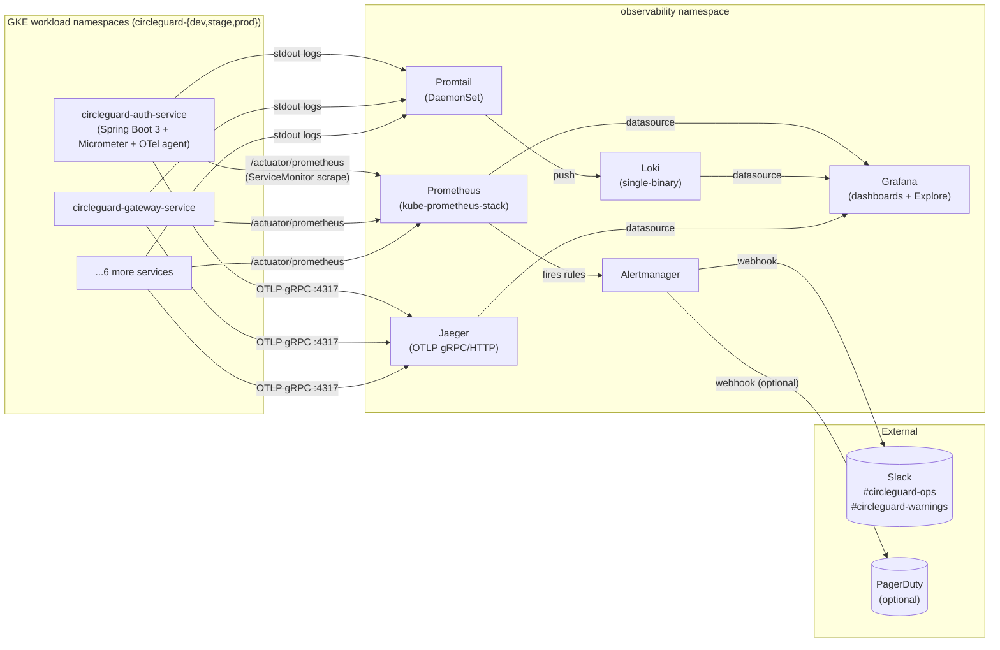

# CircleGuard Observability Architecture

This document describes the metrics, logs, traces, alerts, dashboards and
business-metric conventions for CircleGuard. It satisfies **Requirement 7
(Observabilidad y Monitoreo, 10%)** of the final project rubric and serves
as the operating handbook for SRE on-call.

The manifests that implement this architecture live in
[`infra/k8s/observability/`](../infra/k8s/observability/).

---

## 1. Architecture



The agent flow is "pull" for metrics (Prometheus scrapes the workload's
`/actuator/prometheus`) and "push" for logs (Promtail DaemonSet ships
container stdout to Loki) and traces (Spring Boot's OpenTelemetry exporter
pushes OTLP to Jaeger). This matches the standard CNCF reference stack.

---

## 2. Dashboards

| Dashboard               | UID            | Answers                                                                                                       | How to access                                                                                       |
|-------------------------|----------------|---------------------------------------------------------------------------------------------------------------|-----------------------------------------------------------------------------------------------------|
| Gateway Service         | `cg-gateway`   | "Is the front door healthy? Are we breaking the latency SLO? Is any downstream CB open?"                      | Grafana -> Dashboards -> CircleGuard / Gateway Service                                              |
| Auth Service            | `cg-auth`      | "Are logins succeeding? What is the error budget burn rate?"                                                  | Grafana -> Dashboards -> CircleGuard / Auth Service                                                 |
| Dashboard Service       | `cg-dashboard` | "How is the admin UI backend behaving under load?"                                                            | Grafana -> Dashboards -> CircleGuard / Dashboard Service                                            |
| (template) Other 5 svcs | `cg-<svc>`     | Same RED + JVM panel set, generated from the same template                                                    | Copy `gateway-service.json`, replace `circleguard-gateway-service` with the target service name     |
| kube-prometheus-stack defaults | many   | Cluster, node, namespace, workload, API-server, etcd, kubelet health                                          | Grafana -> Dashboards -> "Kubernetes / *"                                                           |

Each CircleGuard dashboard contains five panels: **RPS**, **latency p50/p95/p99**, **5xx error %**, **JVM heap by pool**, **Circuit breakers OPEN**.
The datasource is a templated `${DS_PROMETHEUS}` so the same JSON works in dev/stage/prod.

---

## 3. Alerts

Defined in [`infra/k8s/observability/alerts/circleguard-slo-rules.yaml`](../infra/k8s/observability/alerts/circleguard-slo-rules.yaml).

| Alert                          | Severity | Trigger (PromQL summary)                                       | Runbook                                                                       |
|--------------------------------|----------|----------------------------------------------------------------|-------------------------------------------------------------------------------|
| `GatewayLatencyBurnRateFast`   | critical | p95 > 500ms on both 5m AND 1h windows for 2m                   | [gateway-slo-burn](runbooks/gateway-slo-burn.md)                              |
| `GatewayLatencyBurnRateSlow`   | warning  | p95 > 500ms on both 30m AND 6h windows for 15m                 | [gateway-slo-burn](runbooks/gateway-slo-burn.md)                              |
| `AuthErrorBudgetBurnFast`      | critical | 5xx rate > 14.4% on both 5m AND 1h windows for 2m              | [gateway-slo-burn](runbooks/gateway-slo-burn.md)                              |
| `AuthErrorBudgetBurnSlow`      | warning  | 5xx rate > 6% on both 1h AND 6h windows for 15m                | [gateway-slo-burn](runbooks/gateway-slo-burn.md)                              |
| `PodCrashLooping`              | critical | >3 container restarts in 15m sustained for 5m                  | [pod-crashloop](runbooks/pod-crashloop.md)                                    |
| `PodHighMemory`                | warning  | working-set > 90% of memory limit for 10m                      | [pod-crashloop](runbooks/pod-crashloop.md)                                    |
| `KafkaConsumerLag`             | warning  | consumer group lag > 10k records for 10m                       | [kafka-consumer-lag](runbooks/kafka-consumer-lag.md)                          |
| `ServiceDown`                  | critical | `up == 0` for 3m                                                | [pod-crashloop](runbooks/pod-crashloop.md)                                    |
| `CircuitBreakerOpen`           | warning  | `resilience4j_circuitbreaker_state{state="open"} == 1` for 1m   | [gateway-slo-burn](runbooks/gateway-slo-burn.md)                              |

Burn-rate thresholds follow the **Google SRE workbook** multi-window
multi-burn-rate recipe (fast 1h, slow 6h) — see the
[Implementing SLOs](https://sre.google/workbook/alerting-on-slos/) chapter.

Routing:

* `severity=critical` -> Slack `#circleguard-ops` (Sev-1)
* `severity=warning`  -> Slack `#circleguard-warnings` (Sev-2)
* `severity=info`     -> dropped (visible in Grafana, never paged)

Inhibitions silence dependent alerts: e.g. `ServiceDown` mutes every
`High*` alert for the same service, and `NodeNotReady` mutes any
`PodCrashLooping` on that node.

---

## 4. Business metrics (Req 7 explicit requirement)

Three product-level KPIs are exposed by the services via Micrometer so
the business team can wire them into the same Grafana stack as the SRE
team. They are **not** infrastructure metrics — they directly answer
business questions ("how many active circles do we have right now?").

| Metric                              | Type      | Service                  | Labels                  | Meaning                                            |
|-------------------------------------|-----------|--------------------------|-------------------------|----------------------------------------------------|
| `circleguard_promotions_total`      | counter   | promotion-service        | `circle_id`, `tier`     | Number of promotions ever created                  |
| `circleguard_active_circles`        | gauge     | dashboard-service        | `region`                | Currently active circles (sampled every 30s)       |
| `circleguard_check_ins_rate`        | counter   | form-service             | `circle_id`, `result`   | Check-in events (rate by minute = activity proxy)  |

### How to expose them from Spring Boot

Add the dependency once in each service:

```kotlin
// build.gradle.kts
implementation("io.micrometer:micrometer-registry-prometheus")
```

Then register them with the `MeterRegistry`:

```java
// PromotionsMetrics.java
@Component
@RequiredArgsConstructor
public class PromotionsMetrics {

    private final MeterRegistry registry;

    public void recordPromotion(String circleId, String tier) {
        registry.counter(
            "circleguard_promotions_total",
            "circle_id", circleId,
            "tier", tier
        ).increment();
    }
}

// ActiveCirclesGauge.java
@Component
public class ActiveCirclesGauge {

    public ActiveCirclesGauge(MeterRegistry registry, CircleService circles) {
        Gauge.builder("circleguard_active_circles", circles, CircleService::countActive)
             .tag("region", System.getenv().getOrDefault("REGION", "us-central1"))
             .register(registry);
    }
}
```

Sample PromQL for a business dashboard:

```promql
# Promotion velocity (last 5 minutes), per tier
sum by (tier) (rate(circleguard_promotions_total[5m]))

# Active circles right now
sum by (region) (circleguard_active_circles)

# Check-ins per minute, successful only
sum(rate(circleguard_check_ins_rate{result="ok"}[1m]))
```

---

## 4.bis Distributed Tracing with the OpenTelemetry Java Agent

Spans are produced by a **shared-volume init container** rather than by
adding the OTel SDK to every service's build. This satisfies rubric
Requirement 7 ("tracing distribuido") with zero source-code changes —
every Spring Boot service is auto-instrumented at JVM boot.

The patch lives at
[`infra/k8s/observability/otel-agent-patch.yaml`](../infra/k8s/observability/otel-agent-patch.yaml)
and is wired into the dev rollout via
[`k8s/dev/kustomization.yaml`](../k8s/dev/kustomization.yaml). Full
operator handbook (apply / verify / roll back / `ghcr.io`-free
variant): [`infra/k8s/observability/otel-agent-README.md`](../infra/k8s/observability/otel-agent-README.md).

### What gets injected

```
+--------------------- Pod ----------------------+
|  initContainer: otel-agent-init                |
|    autoinstrumentation-java:2.5.0              |
|    cp /javaagent.jar -> emptyDir /otel/        |
|                                                |
|  container: <service-name>                     |
|    JAVA_TOOL_OPTIONS=-javaagent:/otel/...jar   |
|    OTLP/HTTP -> jaeger-collector :4318         |
+------------------------------------------------+
```

### Configuration

| OTel env var                  | Value                                                                                  | Why                                                                          |
|-------------------------------|----------------------------------------------------------------------------------------|------------------------------------------------------------------------------|
| `OTEL_EXPORTER_OTLP_ENDPOINT` | `http://jaeger-collector.observability.svc.cluster.local:4318`                         | OTLP/HTTP, plain in-cluster traffic                                          |
| `OTEL_EXPORTER_OTLP_PROTOCOL` | `http/protobuf`                                                                        | Crosses every NetworkPolicy that already allows HTTP                         |
| `OTEL_SERVICE_NAME`           | `metadata.labels['app']` via downward API                                              | Each service shows up under its own name in the Jaeger UI                    |
| `OTEL_RESOURCE_ATTRIBUTES`    | `deployment.environment=dev,service.namespace=circleguard`                             | Groups all 8 services under one product in Jaeger search                     |
| `OTEL_TRACES_SAMPLER`         | `parentbased_traceidratio`                                                             | Honours upstream sampling decisions; no orphan spans                         |
| `OTEL_TRACES_SAMPLER_ARG`     | `0.1`                                                                                  | 10% head-based — matches `jaeger/values.yaml` `default_strategy`             |
| `OTEL_METRICS_EXPORTER`       | `none`                                                                                 | Prometheus already scrapes `/actuator/prometheus`; avoid double-counting     |
| `OTEL_LOGS_EXPORTER`          | `none`                                                                                 | Promtail already ships stdout to Loki                                        |

### Sampling rationale (10%)

Head-based 10% sampling keeps the Jaeger memory backend within its
50k-trace budget while still giving developers enough spans to debug a
single user journey. The same value lives in the Jaeger Helm
`samplingConfig` so the collector and the SDK agree — preventing the
"agent sampled in, collector sampled out" trap that drops random spans
silently.

For load tests, set `OTEL_TRACES_SAMPLER_ARG=1.0` on the deployment
under test. For prod once volume stabilises, drop to `0.01` and graduate
to tail-based sampling at an **OpenTelemetry Collector** (DaemonSet) —
that's the upgrade path documented in the README.

### Production upgrade path

The current setup sends OTLP directly from the JVM to Jaeger. In prod
this should become:

```
JVM agent -> OTel Collector (DaemonSet) -> Jaeger (Elasticsearch backend)
                                      \-> Tempo / X-Ray / etc. (optional)
```

The Collector adds tail-based sampling (keep 100% of errors and slow
traces), redaction (PII), batching, retries with back-off and
multi-backend fan-out. The change is configuration-only — services keep
emitting OTLP on `4318`, only the target IP changes.

---

## 5. Health checks

Each Spring Boot service must expose split health groups so K8s probes
can distinguish "JVM is alive" from "ready to serve":

```yaml
# application.yaml (per service)
management:
  endpoints:
    web:
      exposure:
        include: health,info,prometheus
  endpoint:
    health:
      probes:
        enabled: true          # adds /actuator/health/liveness + /readiness
      group:
        liveness:
          include: livenessState
        readiness:
          include: readinessState, db, kafka, redis
```

The Kubernetes Deployment then wires the probes (see
[`infra/k8s/observability/health-probes-patch.yaml`](../infra/k8s/observability/health-probes-patch.yaml)):

* **startupProbe**  - 60s grace period for slow JVM warm-up
* **livenessProbe** - `/actuator/health/liveness`, restarts the pod on failure
* **readinessProbe** - `/actuator/health/readiness`, removes the pod from the LB on failure

Rule of thumb: **liveness must never depend on a downstream service**
(otherwise a Kafka outage causes a cluster-wide restart loop). Put
downstream health checks in **readiness** only.

---

## 6. Trade-offs

### Why Grafana Loki and not the ELK stack

The rubric mentions "ELK or equivalent" for log centralization. We picked
**Grafana Loki** for the following reasons:

* **Cost / footprint** — Loki indexes only labels, storing chunks
  compressed in object storage. On our GKE budget (e2-standard-2 nodes)
  an ELK install would dominate node memory before any apps were
  scheduled.
* **Operational simplicity** — single Helm chart, one binary,
  Promtail DaemonSet. ELK requires Elasticsearch (3-node minimum for HA),
  Logstash and Kibana to be operated separately.
* **One UI** — Loki integrates with Grafana so engineers explore metrics,
  logs and traces in one place. Grafana Explore + LogQL is the
  Kibana-equivalent in this stack.

> The rubric's intent — *centralized log storage + indexed query +
> Kibana-equivalent UI* — is satisfied by Loki + Promtail + Grafana
> Explore. Trade-off recorded here so reviewers see the conscious
> decision rather than an oversight.

If product requirements later mandate full-text indexing over the entire
log body (security forensics, compliance e-discovery), we will migrate
to Elasticsearch + Filebeat using the same Promtail collection points.

### Why Jaeger memory storage in dev

All-in-one + memory storage loses traces on restart, but in dev we
care about correlating a single trace from a single test run, not
retaining 30 days of traces. Stage and prod should flip the commented
Elasticsearch block in `jaeger/values.yaml` once an ES backend is
available.

---

## 7. CG-009 / CG-010 / CG-011 mapping

| Issue   | Title                                | Closed by                                                                                       |
|---------|--------------------------------------|-------------------------------------------------------------------------------------------------|
| CG-009  | Centralized metrics & dashboards     | kube-prometheus-stack + ServiceMonitors + Grafana dashboards in this directory                  |
| CG-010  | Centralized logs                     | Loki + Promtail DaemonSet                                                                       |
| CG-011  | Alerting and on-call routing         | PrometheusRule + Alertmanager Slack routing + runbooks in `docs/runbooks/`                      |
