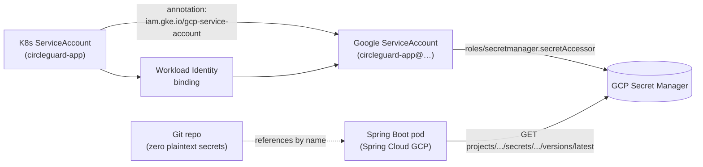

# CircleGuard — Security Architecture

This document is the **Req 8 (Seguridad, 5 %)** deliverable. It maps every
security control to its implementation file, its operating procedure, and
the FERPA requirement it satisfies.

> Companion documents:
> - [`ARCHITECTURE.md`](ARCHITECTURE.md) §7 — where each control sits in the system.
> - [`OPERATIONS.md`](OPERATIONS.md) §3.5–3.7 — secret rotation playbooks.
> - [`CI_CD.md`](CI_CD.md) — pipeline-side scanning.
> - [`CHANGE_MANAGEMENT.md`](CHANGE_MANAGEMENT.md) — release sign-off includes a security check.

---

## 0. Threat model (one paragraph)

CircleGuard's most prized asset is the **link between a student's real
identity and their health status**. The attacker we design against is a
*motivated insider* — someone with limited cluster access who wants to
re-identify a single case. Defending against nation-state attackers is
explicitly out of scope. The system therefore optimises for *containment
of the identity vault*: even a full cluster compromise of every service
except `identity-service` should not leak a single real name.

---

## 1. Vulnerability scanning

### 1.1 Pipeline scans

Every CI run executes two Trivy passes plus a syft SBOM. Configuration
lives in `.gitlab/ci/security.yml`.

| Stage              | Tool              | Scope                                       | Failure threshold                |
|--------------------|-------------------|---------------------------------------------|----------------------------------|
| `security:fs`      | `trivy fs`        | Source repo, lockfiles, IaC                  | `HIGH` or `CRITICAL` → fail      |
| `security:image`   | `trivy image`     | Each built container image (matrix)          | `HIGH` or `CRITICAL` → fail      |
| `security:sbom`    | `syft packages`   | Each image                                   | Artifact only (no gate)          |
| `security:zap`     | OWASP ZAP baseline| Deployed stage env after deploy:stage        | Warn-only on first run, fail after baseline established |

Outputs:

- **SARIF** artifacts uploaded as GitLab security reports → appear in the
  MR widget for review.
- **SBOM** (`syft`) JSON archived for 90 days for compliance e-discovery.
- **ZAP HTML report** archived as a job artifact, link posted to Slack
  after stage deploy.

### 1.2 Exception process (`.trivyignore`)

When an unfixable CVE blocks a release:

1. Open a GitLab issue with label `security:exception` describing:
   - CVE ID, CVSS, affected component, blast radius if exploited.
   - Mitigating control already in place (e.g. "not reachable from the
     gateway", "library only used at build time").
   - Expiration date (must be ≤ 30 days unless renewed).
2. Add the CVE ID to `.trivyignore` in the repo root, **including a
   comment** linking to the issue ID:

   ```
   # CG-217 — netty-bom CVE-2024-12345, exp. 2026-07-01, not reachable from gateway
   CVE-2024-12345
   ```

3. The MR adding the line requires a CODEOWNER approval (CODEOWNERS
   includes the security lead).
4. A nightly CI job (`security:trivyignore-audit`) fails if any line in
   `.trivyignore` lacks a comment or has expired.

---

## 2. Secrets management

### 2.1 Source of truth: GCP Secret Manager

**No plaintext secret ever lives in a Kubernetes manifest, a Helm value,
or a Git-committed file.** The chain is:



### 2.2 How a Spring Boot service reads a secret

In `bootstrap.yaml`:

```yaml
spring:
  config:
    import: "sm@"          # Spring Cloud GCP secret-manager prefix
  cloud:
    gcp:
      secretmanager:
        enabled: true
        project-id: ${GCP_PROJECT}
```

Reference the secret in `application.yaml`:

```yaml
spring:
  datasource:
    password: ${sm@cloudsql-password-prod}
  kafka:
    properties:
      sasl.jaas.config: ${sm@kafka-sasl-jaas-prod}
```

The pod has **no env var, no mounted Secret, no SA-key JSON**. The only
credential is its Workload Identity binding, which is a GCP-controlled
OIDC trust relationship.

Rotation playbook in [`OPERATIONS.md`](OPERATIONS.md) §3.6.

### 2.3 GitLab CI variables

- All credentials are **Masked** + **Protected** (visible only on
  protected branches and protected environments).
- The `production` environment is itself protected, so only the
  `release-managers` group sees `KUBE_CONFIG_PROD`.
- A CI variable is *never* the source of truth — it is either a
  pointer (e.g. SA key used to fetch from Secret Manager) or a config
  value (URLs, registry names).
- Variables are documented in [`CI_CD.md`](CI_CD.md) §"Required GitLab
  CI/CD variables". Variables not listed there are forbidden; CODEOWNER
  approval is required to add one.

---

## 3. RBAC — three layers

The principle of least privilege is applied at every layer of the stack.

### 3.1 Kubernetes RBAC (cluster operators)

| Role                  | Cluster verbs                               | Subjects                          |
|-----------------------|---------------------------------------------|-----------------------------------|
| `cluster-admin`       | All                                          | 2 named SREs (off-boarding alerts)|
| `circleguard-developer`| `get,list,watch` cluster-wide; `*` on `circleguard-dev` | Dev team           |
| `circleguard-releaser`| `get,list,watch` cluster-wide; `*` on `circleguard-{stage,master}` | release-managers GitLab group |
| `circleguard-readonly`| `get,list,watch` everywhere                  | On-call (read access during incidents) |

Bindings live in `infra/terraform/modules/gcp-iam/`. Workload pods use
service accounts scoped to their namespace and a *role-based*
ServiceAccount — never `default`.

### 3.2 Istio AuthorizationPolicy (service-to-service)

Default-deny is in `infra/k8s/istio/authorization-policies/default-deny.yaml`,
then per-route allow rules pin who may call whom:

| File                                | Allows                                                                              |
|-------------------------------------|-------------------------------------------------------------------------------------|
| `default-deny.yaml`                 | (none — denies everything in the namespace)                                          |
| `gateway-to-services.yaml`          | `gateway-service` ServiceAccount → `auth`, `form`, `dashboard`, `file`              |
| `health-center-to-promotion.yaml`   | `dashboard-service` SA (Health Center authenticated) → `promotion-service` POST     |

Sample (excerpt from `gateway-to-services.yaml`):

```yaml
apiVersion: security.istio.io/v1
kind: AuthorizationPolicy
metadata:
  name: allow-gateway-to-auth
  namespace: circleguard-master
spec:
  selector:
    matchLabels:
      app: circleguard-auth-service
  action: ALLOW
  rules:
    - from:
        - source:
            principals: ["cluster.local/ns/circleguard-master/sa/circleguard-gateway-service"]
      to:
        - operation:
            methods: ["POST", "GET"]
            paths: ["/api/v1/auth/*"]
```

Failure mode: a malicious pod with **valid** Spring Security creds but
the **wrong SPIFFE identity** is rejected at the sidecar before its
request ever reaches the application.

### 3.3 Spring Security (end-user)

| Role             | Granted to              | Can do                                                          |
|------------------|-------------------------|-----------------------------------------------------------------|
| `ROLE_STUDENT`   | LDAP user, default      | Submit symptoms, view own status, scan QR.                      |
| `ROLE_HEALTH_CTR`| LDAP group `healthctr`  | Above + view circles, trigger fences, view de-identified data.  |
| `ROLE_HC_ADMIN`  | LDAP group `hc-admin`   | Above + access to identity vault (audited).                     |
| `ROLE_SYS_ADMIN` | LDAP group `cg-admins`  | Feature toggle flips, audit-log download.                       |

Spring Security expression-based authorisation:

```java
@PreAuthorize("hasRole('HEALTH_CTR') and #circle.center == authentication.principal.center")
public CircleView viewCircle(@P("circle") Circle circle) { ... }
```

Every `@PreAuthorize` is unit-tested with `@WithMockUser`. Misconfigured
roles are caught at build time, not in production.

---

## 4. TLS

### 4.1 Public ingress: cert-manager + Let's Encrypt

- `infra/k8s/istio/gateway/cert-manager-issuer.yaml` defines a
  `ClusterIssuer` for Let's Encrypt production with HTTP-01 challenges.
- `infra/k8s/istio/gateway/istio-gateway.yaml` declares the `Gateway`
  resource binding `api.circleguard.edu` to the cert.
- Renewal is automatic ~30 days before expiry; on failure
  alert `CertManagerRenewalFailed` pages on-call.

### 4.2 Service-to-service: Istio mTLS STRICT

`infra/k8s/istio/peer-authentication-strict.yaml`:

```yaml
apiVersion: security.istio.io/v1
kind: PeerAuthentication
metadata:
  name: default
  namespace: istio-system
spec:
  mtls:
    mode: STRICT
```

This applies mesh-wide because the manifest is in `istio-system` with no
selector. Every inter-pod call is mTLS-encrypted with SPIFFE certs
auto-rotated every 24 h by istiod. Plaintext attempts are dropped.

Verify:

```bash
istioctl authn tls-check <pod>.<ns>
# Expect:  STATUS=OK    AUTHN POLICY=default/istio-system
```

### 4.3 Database TLS

- Cloud SQL connections use the Cloud SQL Auth Proxy sidecar, which
  enforces TLS without the application needing to know.
- Neo4j uses `bolt+s://` with the cluster cert mounted as a CSI driver
  read-only volume.
- Kafka uses SASL_SSL with mTLS to brokers.

No service ever talks plaintext to a stateful store.

---

## 5. Network policies

Default-deny per namespace, then allow-list. Sample for
`circleguard-master`:

```yaml
# infra/k8s/security/network-policies/default-deny.yaml
apiVersion: networking.k8s.io/v1
kind: NetworkPolicy
metadata:
  name: default-deny-all
  namespace: circleguard-master
spec:
  podSelector: {}
  policyTypes: [Ingress, Egress]
---
apiVersion: networking.k8s.io/v1
kind: NetworkPolicy
metadata:
  name: allow-gateway-ingress
  namespace: circleguard-master
spec:
  podSelector:
    matchLabels:
      app: circleguard-gateway-service
  policyTypes: [Ingress]
  ingress:
    - from:
        - namespaceSelector:
            matchLabels:
              name: istio-system
      ports:
        - protocol: TCP
          port: 8087
---
apiVersion: networking.k8s.io/v1
kind: NetworkPolicy
metadata:
  name: allow-egress-dns-and-mesh
  namespace: circleguard-master
spec:
  podSelector: {}
  policyTypes: [Egress]
  egress:
    - to:
        - namespaceSelector:
            matchLabels:
              name: kube-system
      ports:
        - protocol: UDP
          port: 53
    - to:
        - namespaceSelector: {}                # any pod in any namespace
        - podSelector:
            matchLabels:
              app: circleguard-auth-service
      ports:
        - protocol: TCP
          port: 8081
    # ... one egress rule per (caller → callee) pair in the
    # gateway-to-services AuthorizationPolicy.
```

If the file `infra/k8s/security/network-policies/` is empty in a fresh
clone, the snippet above is the seed — copy it under the path and apply
with `kubectl apply -k infra/k8s/security/network-policies/`.

Layered defence: **even if** an Istio AuthZ misconfig allowed a
side-channel, the L3 NetworkPolicy would still drop the packet.

---

## 6. Audit logging

Three layers of audit, written to three sinks, all queryable from one UI
(Grafana Loki via Explore).

| Layer              | Source                                  | Destination               | Retention |
|--------------------|-----------------------------------------|---------------------------|-----------|
| GKE audit log      | Kubernetes API server                   | Cloud Logging → BigQuery sink | 365 d |
| K8s audit policy   | `audit-policy.yaml` (RequestResponse on Secret/RBAC) | Cloud Logging | 365 d |
| App-level audit    | Spring `AuditEvent` published to Kafka `audit.events` | Loki (via Promtail) + GCS cold storage | 7 y |

Application audit topic carries: `who`, `when`, `what` (action),
`target` (resource ID — *anon UUID only*, never the real name), `result`
(success/failure), `correlation-id` (W3C trace ID for trace stitching).

Sample audit log line:

```json
{
  "ts": "2026-05-30T14:23:11.123Z",
  "actor": "user:lhdzh1029",
  "actor_role": "HEALTH_CTR",
  "action": "circle.fence.applied",
  "target_anon_uuid": "0xabc123-...-def",
  "result": "success",
  "trace_id": "00-3b1f...e9-...-01",
  "service": "promotion-service",
  "version": "v1.4.0"
}
```

For FERPA forensics, the response to "show me every access to anon-UUID
0xabc123 in the last 90 days" is one LogQL query.

---

## 7. FERPA compliance mapping

| FERPA requirement                                                                | How CircleGuard satisfies it                                                                              | Evidence                                                                                              |
|----------------------------------------------------------------------------------|-----------------------------------------------------------------------------------------------------------|-------------------------------------------------------------------------------------------------------|
| **Right of access** — student can view their own records.                        | `GET /api/v1/students/me` returns all records keyed to the caller's anon UUID.                            | `services/circleguard-identity-service/.../MeController.java` (after CG-021)                          |
| **Right to amend** — student can request correction.                             | "Report incorrect record" flow opens a GitLab issue + manual review by Health Center Officer.            | Mobile app `ReportIncorrectScreen`; runbook (to author: CG-022).                                       |
| **Right to control disclosure** — only de-identified data flows beyond Health Center. | All non-identity services receive **anon UUIDs only**; the mapping is in one Postgres table guarded by `identity-service`. | [`ARCHITECTURE.md`](ARCHITECTURE.md) §4, "Critical privacy invariant".                       |
| **Disclosure logging** — every access to PII must be auditable.                  | Every `identity-service` lookup writes an `AuditEvent` to `audit.events` Kafka topic.                     | §6 above; `services/circleguard-identity-service/.../IdentityAuditAspect.java`.                      |
| **Right to be forgotten** — student may request full erasure.                    | `POST /api/v1/identity/forget` publishes `identity.purge.requested`; cascading delete across all services. | `init-db.sql` cascading FKs; `notification-service` and `dashboard-service` consume the purge topic.  |
| **Data minimisation** — collect only what is needed.                             | Symptom survey fields reviewed quarterly; new fields require Privacy Officer sign-off.                    | [`docs/USER_STORIES.md`](USER_STORIES.md) story templates include a "PII fields" section.             |
| **Encryption at rest** — PII not stored plaintext.                               | Cloud SQL CMEK with key rotated annually; identity vault uses application-level salted-hash.              | `infra/terraform/modules/gcp-cloudsql/main.tf` (CMEK), Spring `BCryptPasswordEncoder` for hashes.    |
| **Encryption in transit** — all hops encrypted.                                  | TLS on public ingress; mTLS STRICT mesh-wide; TLS to all stateful stores.                                 | §4 above.                                                                                              |
| **Access controls** — least privilege.                                           | Three-layer RBAC (K8s, Istio AuthZ, Spring Security).                                                     | §3 above.                                                                                              |
| **Breach notification** — incident response process.                             | `incident-commander` role pages within 15 min; templated comms in `#circleguard-ops`.                     | [`OPERATIONS.md`](OPERATIONS.md) §4.                                                                  |
| **Data retention limits** — temporal privacy.                                    | Contact graph edges TTL'd at 14 days; Kafka audit retention 7 y; Loki logs 30/90/365 d by env.            | Neo4j `ON CREATE SET edge.ttl = now() + 14d` constraint; Loki retention config in `loki/values.yaml`. |

Open gaps to acknowledge:

- **Annual external pen-test** is required by FERPA for institutions
  above a certain enrolment threshold — not yet engaged. Tracked in
  `CG-098`.
- **Privacy Impact Assessment (PIA)** document — drafted but not signed
  by university counsel. Tracked in `CG-097`.

---

## 8. Checklist for every release

The release manager confirms during the prod approval gate
(see [`CHANGE_MANAGEMENT.md`](CHANGE_MANAGEMENT.md) §2):

- [ ] Trivy fs + image scans green (or all `.trivyignore` entries
      explained + unexpired).
- [ ] ZAP baseline scan green against stage.
- [ ] No new K8s Secret manifest committed; new credentials in Secret
      Manager.
- [ ] If new service: Istio AuthorizationPolicy + NetworkPolicy added.
- [ ] If new endpoint touching PII: audit-event emitted, log line includes
      anon UUID only.
- [ ] Release notes mention any security-relevant change.
