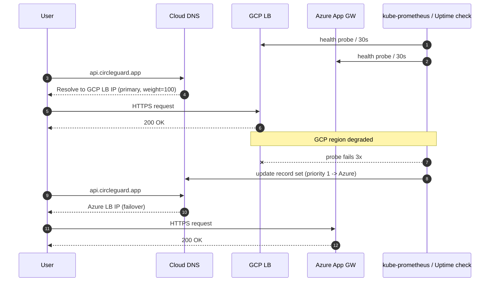

# CircleGuard — Cloud Infrastructure Architecture

This document describes the target cloud topology provisioned by the
Terraform modules in `infra/terraform/`. GCP is the **primary** runtime;
Azure is **secondary / DR** in `stage` and `prod`.

## High-level diagram

```mermaid
flowchart LR
  subgraph Internet
    USER([Users / Mobile App])
    DNS[(Cloud DNS<br/>+ health checks<br/>weighted/failover)]
  end

  USER --> DNS

  subgraph GCP[GCP - primary]
    direction TB
    subgraph VPC[VPC circleguard-env-vpc]
      direction TB
      LB1[(HTTP(S) LB<br/>+ Cloud Armor)]
      subgraph SUBNET[Subnet 10.x.0.0/20]
        GKE[GKE regional cluster<br/>VPC-native + WI]
      end
      NAT[Cloud NAT]
      CSQL[(Cloud SQL<br/>Postgres 16<br/>private IP)]
      AR[(Artifact Registry<br/>Docker repo)]
    end
    LB1 --> GKE
    GKE -- private peering --> CSQL
    GKE -- egress --> NAT
    GKE -- pull --> AR
  end

  subgraph AZURE[Azure - secondary]
    direction TB
    subgraph VNET[VNet circleguard-env-vnet]
      direction TB
      LB2[(Azure LB / App Gateway)]
      subgraph ASUB[AKS subnet 10.x.0.0/20]
        AKS[AKS cluster<br/>system + user + spot pools]
      end
      ACR[(Azure Container Registry)]
    end
    LB2 --> AKS
    AKS -- AcrPull --> ACR
  end

  DNS --> LB1
  DNS -. failover .-> LB2

  AR -.replicate via CI.-> ACR
```

## Resource map per environment

| Env   | GCP VPC CIDR  | Pods/Svcs           | Azure VNet      | DB                       | Notes                                  |
|-------|---------------|---------------------|-----------------|--------------------------|----------------------------------------|
| dev   | 10.10.0.0/20  | 10.20/16, 10.30/20  | (none)          | db-f1-micro, ZONAL       | Spot nodes; ~$60-90/mo                 |
| stage | 10.40.0.0/20  | 10.50/16, 10.60/20  | 10.70.0.0/16    | db-custom-1-3840, ZONAL  | Spot enabled both sides                |
| prod  | 10.80.0.0/20  | 10.90/16, 10.100/20 | 10.110.0.0/16   | db-custom-2-7680, REGIONAL | On-demand primary pool + optional spot |

CIDRs are non-overlapping by design so a future hub-and-spoke VPN/peering
can join all three envs without re-IPing.

## Multi-cloud failover



**Strategy**

1. **Active-passive** at the DNS layer using Cloud DNS routing policies
   (`FAILOVER` policy with health-checked backends). GCP is active by
   default; Azure absorbs traffic only when GCP backends are unhealthy
   for >90 seconds.
2. **Data layer**: Cloud SQL is the source of truth. Azure-side workloads
   read/write through the Cloud SQL Auth Proxy over a VPN/Interconnect or
   (cheaper, dev/stage) over the public endpoint with authorized networks.
   For a true HA story, students should add Cloud SQL cross-region read
   replicas and a manual promote-on-DR runbook — out of scope for v1.
3. **Image registry**: CI pushes to **both** AR and ACR on every build.
   AR is primary; ACR is the failover source so AKS can pull without
   cross-cloud traffic during an outage.
4. **Configuration / secrets**: workloads consume secrets via Secret
   Manager (GCP) or Key Vault (Azure), mounted with Workload Identity.
   The same logical name (e.g. `circleguard-db-password`) lives in both
   stores; CI keeps them in sync.

## Networking notes

- **GCP**: VPC-native cluster, private nodes, public master endpoint
  gated by master-authorized-networks. Cloud NAT for egress.
- **Azure**: Azure CNI (VNet-integrated pods), Calico network policy,
  managed identity for the cluster, separate kubelet identity for ACR pulls.

## What the Terraform does NOT (yet) create

- Cloud DNS zone and routing policy records — keep DNS in a separate state
  to avoid blast radius. Recommended next module: `modules/gcp-dns`.
- Cross-cloud VPN / Interconnect.
- Cloud SQL cross-region read replica.
- AppGateway + WAF rules (subnet is reserved, install via Helm or a follow-up module).
- Monitoring stack (Grafana, Prometheus) — delivered by Helm in the CD pipeline.

## Cost guardrails

Every module exposes a knob to drop into a cheaper SKU. Combine these for
demo budgets:

| Knob                          | Effect                                  |
|-------------------------------|-----------------------------------------|
| `gke_preemptible = true`      | -70% node cost                          |
| `gke_node_count_min = 1`      | Scale to one node when idle             |
| `cloudsql_tier = db-f1-micro` | ~$8/mo Postgres                         |
| `aks_spot_enabled = true`     | Spin spot pool, scales to zero          |
| `aks_sku_tier = Free`         | Drop AKS uptime SLA fee (~$73/mo)       |
| Skip Azure modules in dev     | ~$0 Azure spend                         |
